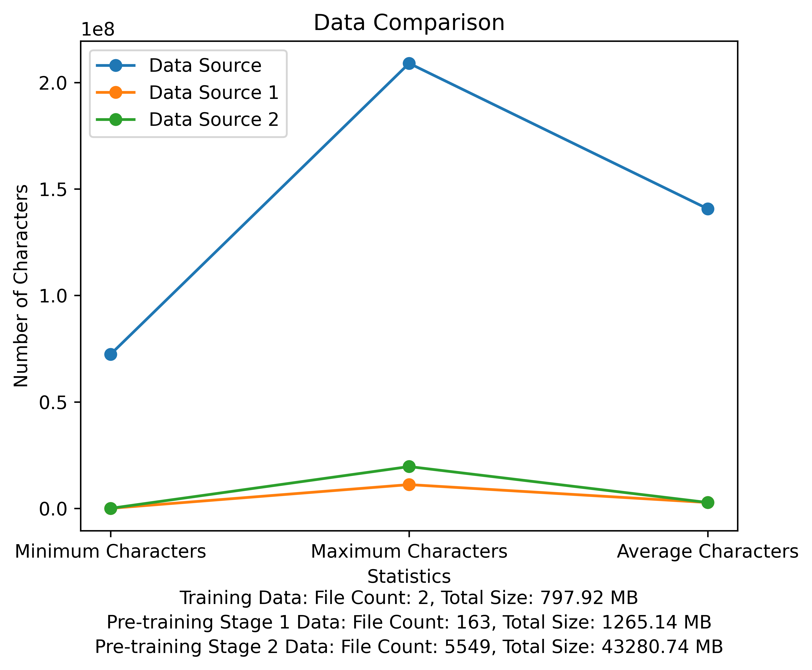

<p align="center">  </p>

<h1 align="center">
  Literary-Alpaca2
</h1>
<p align="center">
  <font face="黑体" color=orange size="6"> 从词表到微调这就是你需要的一切 </font>
</p>

</br></br>


## 🗂️ 使用指南
- [🔥 项目介绍](#-项目介绍)
- [📝 训练数据](#-训练数据)
- [⏬ 模型部署](#-模型部署)
  - [模型下载](#模型下载)
    - [基于Llama2的中文预训练模型](#基于Llama2的中文预训练模型)
    - [基于LiteraryAlpaca2的中文微调模型Chat](#基于LiteraryAlpaca2的中文微调模型Chat)
  - [模型调用示例](#模型调用示例)
- [词表训练](#词表训练)
- [预训练](#预训练)
- [微调](#微调)
  - [数据准备](#数据准备)
  - [微调脚本](#微调脚本)
- [参考论文](#参考论文)


## 🔥 项目介绍


本仓库将展示如何从词表开始构建自己的词表与使用基座模型预训练和微调模型
仓库中的代码示例主要是基于Llama2的Hugging Face版本进行训练。


## 📝 训练数据
| 类型                                                       | 描述                                                         |
| ---------------------------------------------------------- | ------------------------------------------------------------ |
| 网络小说                                                   | 高质量长文本数据 |
| [Math23K](https://opendatalab.org.cn/Math23K)               | 中文数学问题                                          |
| [LCCC](https://github.com/thu-coai/CDial-GPT)               | 中文开源对话集                                       |

</br></br>
词表与预训练阶段数据对比图：
<p align="center">  </p>

## ⏬ 模型部署

<p>Meta官方的下载链接：https://huggingface.co/meta-llama</p>

中文预训练模型、LoRA参数、chat模型都已上传至[Hugging Face](https://huggingface.co/taotie1) 目前只有13B模型。

### 模型下载

#### 基于Llama2的中文预训练模型

|  类别        | 🤗模型名称   | 基座模型          |   下载地址          |
|  ----------  | ---------- |  ----------------- | ------------------- |
|  预训练 | taotie1/literary-alpaca2-13B |     meta-llama/Llama-2-13b-hf     |[模型下载](https://huggingface.co/taotie1/literary-alpaca2-13B) |
|  LoRA | taotie1/literary-alpaca2-13B-lora |      taotie1/literary-alpaca2-13B     |[模型下载](https://huggingface.co/taotie1/literary-alpaca2-13B-lora) |
#### 基于LiteraryAlpaca2的中文微调模型Chat
|  类别           | 🤗模型名称        | 下载地址                                                 |
| --------------- | ---------------    |  ------------------------------------------------------------ |
|  Chat  |  taotie1/literary-alpaca2-13B-chat  | [模型下载](https://huggingface.co/taotie1/literary-alpaca2-13B-chat) |


### 模型调用示例
根据[requirements.txt](https://github.com/kingTLE/literary-alpaca2/blob/main/requirements.txt)安装环境依赖，torch请根据自己的设备选择版本安装。
```python
import torch
from transformers import AutoTokenizer, AutoModelForCausalLM
model = AutoModelForCausalLM.from_pretrained('taotie1/literary-alpaca2-13B-chat',device_map='auto',torch_dtype=torch.float16,load_in_8bit=True)
model =model.eval()
tokenizer = AutoTokenizer.from_pretrained('taotie1/literary-alpaca2-13B-chat',use_fast=False)
tokenizer.pad_token = tokenizer.eos_token
input_ids = tokenizer(['<s>Human: 什么是计算机\n</s><s>Assistant: '], return_tensors="pt",add_special_tokens=False).input_ids.to('cuda')        
generate_input = {
    "input_ids":input_ids,
    "max_new_tokens":512,
    "do_sample":True,
    "top_k":50,
    "top_p":0.95,
    "temperature":0.3,
    "repetition_penalty":1.3,
    "eos_token_id":tokenizer.eos_token_id,
    "bos_token_id":tokenizer.bos_token_id,
    "pad_token_id":tokenizer.pad_token_id
}
generate_ids  = model.generate(**generate_input)
text = tokenizer.decode(generate_ids[0])
print(text)
```

## 词表训练

先对你的训练数据进行[命名清洗](https://github.com/kingTLE/literary-alpaca2/tree/main/chinese-tokenizer/Batch_Rename.py)【可选】</br></br>
选择运行[随机清洗代码](https://github.com/kingTLE/literary-alpaca2/tree/main/chinese-tokenizer/random_sample.py)或[全部清洗](https://github.com/kingTLE/literary-alpaca2/tree/main/chinese-tokenizer/clear.py)，在[ill_ocr_regex.txt](https://github.com/kingTLE/literary-alpaca2/tree/main/chinese-tokenizer/ill_ocr_regex.txt)中可以自定义你的正则。

运行[full_sample_extraction.py](https://github.com/kingTLE/literary-alpaca2/tree/main/chinese-tokenizer/full_sample_extraction.py)把数据合并成一个文件。

参照[train-chinese-tokenizer.ipynb](https://github.com/kingTLE/literary-alpaca2/tree/main/chinese-tokenizer/train-chinese-tokenizer.ipynb)进行词表训练，可以根据自己的需求修改代码。
训练完成后把你的词表放入my-tokenizer目录下。按照下面方式和原llama2的tokenizer合并
```
bash运行
'
Set PROTOCOL_BUFFERS_PYTHON_IMPLEMENTATION=python
python incorporation.py
'
```
运行[text.py](https://github.com/kingTLE/literary-alpaca2/tree/main/chinese-tokenizer/text.py)进行测试词表效果

## 预训练
本仓库训练代码使用[DeepSpeed](https://github.com/microsoft/DeepSpeed)加速
- 请在[预训练脚本 pretrain-peft1.sh](https://github.com/kingTLE/literary-alpaca2/tree/main/train/GPU/pretrain-peft1.sh)中修改你相应的output_model、dataset、pretrained_model_name、tokenizer_name的路径,如果需要上传到你的Hugging Face仓库，请把    --push_to_hub 设置为true并在  --hub_token参数填入你的token，并修改    --hub_model_id
- 多机多卡请修改--nnodes 和 --nproc_per_node 参数
```
如两机8卡：torchrun --nnodes 2 --nproc_per_node 8
```

- 你可以删除[预训练代码 pretrain-peft1.py](https://github.com/kingTLE/literary-alpaca2/tree/main/train/GPU/pretrain-peft1.py)中的下面内容实现全参预训练
```
    for name, param in model.named_parameters():
        if "model.embed_tokens" not in name:
            param.requires_grad = False
        else:
            param.requires_grad = True
```
- 如果难以收敛或内存不足请使用[预训练脚本2 pretrain-peft2.sh](https://github.com/kingTLE/literary-alpaca2/tree/main/train/GPU/pretrain-peft1.sh)，这将允许你训练量化模型，你可以通过调整下面参数适应你的需求
```
      --load_in_kbits 设置量化,不为4或8则不启用量化
      --bf16 | --fp16 启用bf16需要gpu硬件支持
如果出现OOM请在deepspeed_config_peft2.json配置中添加：
    "zero_optimization": {
        "stage": 3,
        "offload_optimizer": {
            "device": "cpu",
            "pin_memory": true
        },
        "offload_param": {
            "device": "cpu",
            "pin_memory": true
        },
        "overlap_comm": true,
        "contiguous_gradients": true,
        "sub_group_size": 1e9,
        "reduce_bucket_size": "auto",
        "stage3_prefetch_bucket_size": "auto",
        "stage3_param_persistence_threshold": "auto",
        "stage3_max_live_parameters": 1e9,
        "stage3_max_reuse_distance": 1e9,
        "stage3_gather_16bit_weights_on_model_save": true
    },
```
-使用[预训练脚本2 pretrain-peft2.sh](https://github.com/kingTLE/literary-alpaca2/tree/main/train/GPU/pretrain-peft1.sh)会生成lora参数，可以运行修改自[Chinese-LLaMA-Alpaca-2](https://github.com/ymcui/Chinese-LLaMA-Alpaca-2/tree/main)的[merge_lora_low_mem.py](https://github.com/kingTLE/literary-alpaca2/tree/main/train/merge_lora_low_mem.py)脚本进行合并

```
python merge_lora_low_mem.py\
    --base_model /root/LiteraryAlpaca2 \
    --lora_model /root/autodl-tmp/LiteraryAlpaca2-lora \
    --output_type huggingface \
    --output_dir /root/autodl-tmp/LiteraryAlpaca2

```

## 微调

### 数据准备
使用sft目录下的转换脚本可以将数据集转换为需要的训练格式：
- Stanford-alpacag格式：[LCCD转换脚本](https://github.com/kingTLE/literary-alpaca2/tree/main/sft/Stanford_lccd.py) [Math23K转换脚本](https://github.com/kingTLE/literary-alpaca2/tree/main/sft/Stanford_math.py)

每个csv文件中包含一列“text”，每一行为一个训练样例，每个训练样例按照以下格式将问题和答案组织为模型输入，您可以按照以下格式自定义训练和验证数据集：

- csv格式：[LCCD转换脚本](https://github.com/kingTLE/literary-alpaca2/tree/main/sft/lccd_csv.py) [Math23K转换脚本](https://github.com/kingTLE/literary-alpaca2/tree/main/sft/math_csv.py)

转换的csv文件中包含一列“text”，每一行为一个训练样例，每个训练样例按照以下格式将问题和答案组织为模型输入，您可以按照以下格式自定义训练和验证数据集：
```
"<s>Human: "+问题+"\n</s><s>Assistant: "+答案
```
例如，
```
<s>Human: 用一句话描述地球为什么是独一无二的。</s><s>Assistant: 因为地球是目前为止唯一已知存在生命的行星。</s>
```
### 微调脚本

LoRA微调脚本见：[train/sft/finetune_lora.sh](https://github.com/FlagAlpha/Llama2-Chinese/blob/main/train/sft/finetune_lora.sh)，关于LoRA微调的具体实现代码见[train/sft/finetune_clm_lora.py](https://github.com/FlagAlpha/Llama2-Chinese/blob/main/train/sft/finetune_clm_lora.py)


## 参考论文

* [Llama 2: Open Foundation and Fine-Tuned Chat Models](https://arxiv.org/abs/2307.09288)
* [LoRA: Low-Rank Adaptation of Large Language Models](https://arxiv.org/abs/2106.09685)
* [QLoRA: Efficient Finetuning of Quantized LLMs](https://arxiv.org/abs/2305.14314)
* [Efficient and Effective Text Encoding for Chinese LLaMA and Alpaca](https://arxiv.org/abs/2304.08177)

<p align="center" width="100%">

</p>
